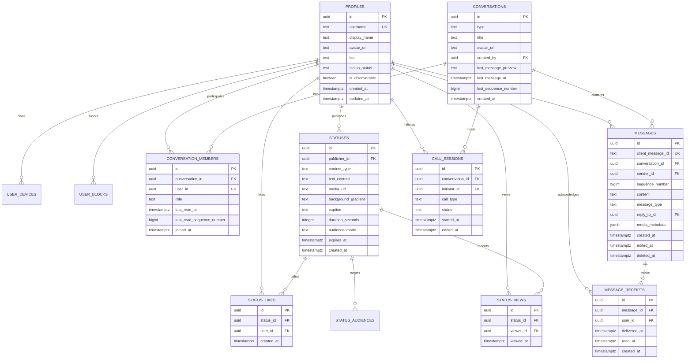

# 14 — Database Entity-Relationship Diagram

```mermaid
erDiagram
    PROFILES ||--o{ USER_DEVICES : owns
    PROFILES ||--o{ USER_BLOCKS : blocks
    PROFILES ||--o{ CONVERSATION_MEMBERS : participates
    PROFILES ||--o{ MESSAGES : sends
    PROFILES ||--o{ MESSAGE_RECEIPTS : acknowledges
    PROFILES ||--o{ STATUSES : publishes
    PROFILES ||--o{ STATUS_VIEWS : views
    PROFILES ||--o{ STATUS_LIKES : likes
    PROFILES ||--o{ CALL_SESSIONS : initiates

    CONVERSATIONS ||--o{ CONVERSATION_MEMBERS : has
    CONVERSATIONS ||--o{ MESSAGES : contains
    CONVERSATIONS ||--o{ CALL_SESSIONS : hosts

    MESSAGES ||--o{ MESSAGE_RECEIPTS : tracks
    STATUSES ||--o{ STATUS_VIEWS : records
    STATUSES ||--o{ STATUS_LIKES : tallies
    STATUSES ||--o{ STATUS_AUDIENCES : targets

    PROFILES {
        uuid id PK
        text username UK
        text display_name
        text avatar_url
        text bio
        text status_status
        boolean is_discoverable
        timestamptz created_at
        timestamptz updated_at
    }

    CONVERSATIONS {
        uuid id PK
        text type
        text title
        text avatar_url
        uuid created_by FK
        text last_message_preview
        timestamptz last_message_at
        bigint last_sequence_number
        timestamptz created_at
    }

    CONVERSATION_MEMBERS {
        uuid id PK
        uuid conversation_id FK
        uuid user_id FK
        text role
        timestamptz last_read_at
        bigint last_read_sequence_number
        timestamptz joined_at
    }

    MESSAGES {
        uuid id PK
        text client_message_id UK
        uuid conversation_id FK
        uuid sender_id FK
        bigint sequence_number
        text content
        text message_type
        uuid reply_to_id FK
        jsonb media_metadata
        timestamptz created_at
        timestamptz edited_at
        timestamptz deleted_at
    }

    MESSAGE_RECEIPTS {
        uuid id PK
        uuid message_id FK
        uuid user_id FK
        timestamptz delivered_at
        timestamptz read_at
        timestamptz created_at
    }

    STATUSES {
        uuid id PK
        uuid publisher_id FK
        text content_type
        text text_content
        text media_url
        text background_gradient
        text caption
        integer duration_seconds
        text audience_mode
        timestamptz expires_at
        timestamptz created_at
    }

    STATUS_VIEWS {
        uuid id PK
        uuid status_id FK
        uuid viewer_id FK
        timestamptz viewed_at
    }

    STATUS_LIKES {
        uuid id PK
        uuid status_id FK
        uuid user_id FK
        timestamptz created_at
    }

    CALL_SESSIONS {
        uuid id PK
        uuid conversation_id FK
        uuid initiator_id FK
        text call_type
        text status
        timestamptz started_at
        timestamptz ended_at
    }
```
